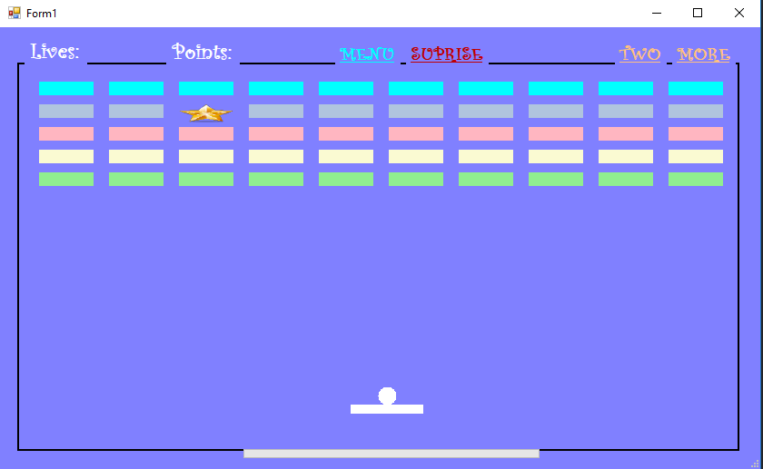
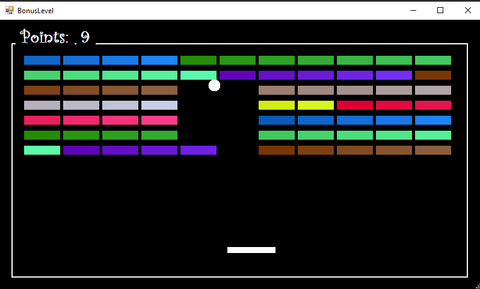

<b>Bricks Ball Crusher</b>

•	Краток опис на апликацијата

Идејата за нашата апликација произлезе од играта Bricks Ball Crusher, со некои наши модификации и дополнителни функционалности. Целта на апликацијата е да се освојат што е можно повеќе поени со ограничен број на животи. Следат подетални информации во врска со апликацијата.

•	Упатства

На почеток, по вклучување на апликацијата се прикажува главно мени на кое има три опции, една за нова игра “New Game”, друга за приказ на вашите поени “You Score”, и трета опција за излез од апликацијата “Exit”.

 

По кликање на "New Game"(или со стрелките лево-десно, па Ентер) се отвара нов прозорец со главната игра. Со кликање на стрелките од тастатурата, лево и десно, се поместува долниот правоаголник кој всушност ние го контролираме. Со првото притискање на било кое копче од двете, лево или десно, топчето започнува да се движи во рандом насока. Кога ќе допре некоја од "тулите", тие се кршаат. Ако во случај бидат допрени повеќе тули тие ќе бидат скршени истовремено. Топчето се одбива назад или ако се удри попат и од други тули и тие се кршат.
 

Ако во некој случај не успеете да го фатите топчето да се одбие, тоа паѓа и ви се одзима еден живот, а вкупно имате три.  
Секоја тула откако ќе биде скршена носи 2 поени, а доколку биде погодена ѕвездата се отвара нов прозорец на Bonus Round на кој можете да соберете гратис поени. Во овој Бонус,најпрво се прикажува слика за Bonus Round, па по 1 секунда се отвара новата игра,во која се следат повторно истите правила за копчињата од тастатура со разлика што топчето не се одбива од самите тули, туку продолжува да ги "руши" до крај додека не се одбие од некој од ѕидовите. Овде секоја тула носи по еден поен. Bonus Round завршува кога топчето ќе падне и се враќа повторно на главната форма и се продолжува од таму каде што застанало кога била чукната ѕвездата и поените соберени од Бонусот се додаваат на моменталните поени од главната форма.

 

 
Во главната форма, на горната страна имаме четири лабели "MENU","SURPRISE","TWO" и "MORE".

Со кликање на Menu ќе ве врати на почетната форма, на менито, со прво приказ на messageBox за дали сакате да излезете од играта.

Surprise може да се кликне најмногу четири пати, и на секој клик ви дава некој рандом бенефиција или нешто што ќе ви наштети на играта. 

Во игра се шест добивки од Surprise: 

1.Да ви се зголеми правоаголникот кој го контролирате;

2.Да ви се намали  правоаголникот кој го контролирате;

3.Да ви се намали брзина на движење на топчето;

4.Да ви се намали радиусот на топчето;

5.Да ви се додаде еден живот;

6.Да ви се одземе еден живот;

Ако ви се падне изненадување од 1-4, започнува да се полни прогрес барот, кој кога ќе се исполни ќе ви заврши тоа што сте го добиле од изненадувањето, односто ќе ве врати во нормала.
