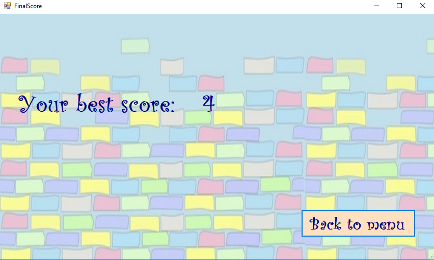

<b>Bricks Ball Crusher</b>

•<b>	Краток опис на апликацијата</b>

Идејата за нашата апликација произлезе од играта Bricks Ball Crusher, со некои наши модификации и дополнителни функционалности. Целта на апликацијата е да се освојат што е можно повеќе поени со ограничен број на животи. Следат подетални информации во врска со апликацијата.

•<b>	Упатства</b>

На почеток, по вклучување на апликацијата се прикажува главно мени на кое има три опции, една за нова игра “New Game”, друга за приказ на вашите поени “You Score”, и трета опција за излез од апликацијата “Exit”.

 

По кликање на "New Game"(или со стрелките лево-десно, па Ентер) се отвара нов прозорец со главната игра. Со кликање на стрелките од тастатурата, лево и десно, се поместува долниот правоаголник кој всушност ние го контролираме. Со првото притискање на било кое копче од двете, лево или десно, топчето започнува да се движи во рандом насока. Кога ќе допре некоја од "циглите", тие се кршаат. Ако во случај бидат допрени повеќе цигли тие ќе бидат скршени истовремено. Топчето се одбива назад или ако се удри попат и од други цигли и тие се кршат.
 

Ако во некој случај не успеете да го фатите топчето да се одбие, тоа паѓа и ви се одзима еден живот, а вкупно имате три.  
Секоја цигла откако ќе биде скршена носи 2 поени, а доколку биде погодена ѕвездата се отвара нов прозорец на Bonus Round на кој можете да соберете гратис поени. Во овој Бонус,најпрво се прикажува слика за Bonus Round, па по 1 секунда се отвара новата игра,во која се следат повторно истите правила за копчињата од тастатура со разлика што топчето не се одбива од самите цигли, туку продолжува да ги "руши" до крај додека не се одбие од некој од ѕидовите. Овде секоја цигла носи по еден поен. Bonus Round завршува кога топчето ќе падне и се враќа повторно на главната форма и се продолжува од таму каде што застанало кога била чукната ѕвездата и поените соберени од Бонусот се додаваат на моменталните поени од главната форма.

 

Во главната форма, на горната страна имаме четири лабели "MENU","SURPRISE","TWO" и "MORE".

Со кликање на Menu ќе ве врати на почетната форма, на менито, со прво приказ на messageBox за дали сакате да излезете од играта.

Surprise може да се кликне најмногу четири пати, и на секој клик ви дава некој рандом бенефиција или нешто што ќе ви наштети на играта. 

Во игра се шест добивки од Surprise: 

1.Да ви се зголеми правоаголникот кој го контролирате;

2.Да ви се намали  правоаголникот кој го контролирате;

3.Да ви се намали брзина на движење на топчето;

4.Да ви се намали радиусот на топчето;

5.Да ви се додаде еден живот;

6.Да ви се одземе еден живот;

Ако ви се падне изненадување од 1-4, започнува да се полни прогрес барот, кој кога ќе се исполни ќе ви заврши тоа што сте го добиле од изненадувањето, односто ќе ве врати во нормала. Ако SURPRISE ја смени бојата во црна тоа значи дека е оневозможено за кликање.

Со кликање на Two (која може да се кликне само доколку топчето не е во движење), и со придвижување со стрелките лево-десно, започнуваат да се движат две топчиња и двете во рандом правец. Второто топче(црно по боја) ќе биде поништено само доколку падне, а ако падне белото топче(главното) ќе исчезнат и двете. Оваа опција ви е овозможена само еднаш.

Со кликање на More(во било кој момент од играта), се појавуват десет топчиња кои започнуваат веднаш да се движат во правец нагоре под прав агол, и кога ќе уништат барем една цигла, се враќаат назад и исчезнуваат. И оваа опција е овозможена само еднаш.

Two и More се опции кои се за помош на играчот.

Доколку во текот на играта ги изгубите сите животи, ќе ви се појави прозорец за дали сакате повторно да играте. Доколку пак ја завршите успешно играта ви се прикажува прозорец со вашиот конечен резултат на поени, и истите се запишуваат и во прозорецот Your Score кој може да се отвори од почетната форма, односо од менито.

•	<b>Функционалности</b>

Играта е составена од 5 класи и тоа: Ball.cs, Brick.cs, Rectangle.cs, BonusGame.cs, Game.cs.

  ➤Во класата Ball.cs се чуваат информации за топчето, се исцртува топчето со кое играете и се поставува движењето на истото.
  
  Функцијата за движење на топчето:
  
        public void Move(int left, int top, int width, int height)
        {
            int nextX = (int)(Center.X + velocityX);
            int nextY = (int)(Center.Y + velocityY);

            int lft = left + Radius;
            int rgt = left + width - Radius;
            int tp = top + Radius;
            int btm = top + height - Radius;

            if (nextX <= lft)
            {
                if (Center.Y <= 55)
                {
                    Angle = r.NextDouble() * 2 * Math.PI;
                    velocityX = (float)(Math.Cos(Angle) * Velocity);
                    velocityY = (float)(Math.Sin(Angle) * Velocity);
                    
                    nextX = lft + (lft - nextX);
                    velocityX = -velocityX;
                }
                else
                {
                    nextX = lft + (lft - nextX);
                    velocityX = -velocityX;
                }
            }
            if (nextX >= rgt)
            {
                if (Center.Y <= 55)
                {
                    Angle = r.NextDouble() * 2 * Math.PI;
                    velocityX = (float)(Math.Cos(Angle) * Velocity);
                    velocityY = (float)(Math.Sin(Angle) * Velocity);
                  
                    nextX = lft + (lft - nextX);
                    velocityX = -velocityX;
                }
                else
                {
                    nextX = rgt - (nextX - rgt);
                    velocityX = -velocityX;
                }
            }
            if (nextY <= tp)
            {
                if (Center.X <= 35)
                {
                    Angle = r.NextDouble() * 2 * Math.PI;
                    velocityX = (float)(Math.Cos(Angle) * Velocity);
                    velocityY = (float)(Math.Sin(Angle) * Velocity);
                    nextY = tp + (tp - nextY);
                    velocityY = -velocityY;
                }
                else
                {
                    nextY = tp + (tp - nextY);
                    velocityY = -velocityY;
                }
            }

            if (nextY >= btm)
            {
                isNewGame = true;
            }
            Center = new Point(nextX, nextY);
        }

 Оваа функција служи за движење на топчето.Топчето се движи така што на почеток се дава агол со помош на рандом генератор, па потоа со    помош на функции се пресметуваат координатите на X и на Y.Во функцијата има повеке услови со кои се проверува дали топчето допрело до некоја од границите(лево,десно,горе,доле) и доколку тоа е точно се менува насоката на движење на топчето т.е се менуваат координатите X и Y. На крај на фунцкцијата се поставуваат новите координати на топчето.
 
   ➤Во класата Brick.cs се чуваат информации за "циглите" и се означуваат кога истите се допрени од страна на топчето.
   
   Функцијата за означување кога циглите се допрени:
  
  
     public void Select(Ball ball)
        {
            if (ball.Center.X + ball.Radius >= X && ball.Center.X - ball.Radius <= X + Width && ball.Center.Y + ball.Radius >= Y && ball.Center.Y - ball.Radius <= Y + Height)
            {
                ball.velocityY = -ball.velocityY;
                isTouched = !isTouched;
            }

        }
   
  
   Оваа функција служи за означување кога една цигла е допрена од страна на топчето.Доколку условот е исполнет т.е циглата е допрена,      тогаш bool променливата IsTouched се поставува на true и исто така се менува насоката на движење на топчето за да не се "рушат" сите 
   цигли одеднаш.
 
   ➤ Во класата Rectangle.cs се чуваат информации за правоаголникот кој го контролираме, функција за негово движење и функција за          означување кога топчето го допрело.
   
   Функцијата за движење на правоаголникот:
   
     public void Move(int left, int width, int x)
        {
            X += x;
            int nextX = X;

            int lft = left;
            int rgt = left + width - Width;

            if (nextX <= lft)
            {
                X -= x;
            }
            if (nextX >= rgt)
            {
                X -= x;
            }
        }
    
  Во функцијата се поставуваат само новите координати на правоаголникот со придвижување на стрелките од тастатурата.
  
  Функцијата која означува кога топчето го допрело правоаголникот е иста со онаа од класата Brick.cs
  
  ➤Во класата BonusGame.cs се чува една листа од тип Brick, информации за листата, фунцкција за додавање, бришење и исцртување на         циглите. 
  
  ➤Во класата Game.cs се чуваат една листа од тип Brick и две листи од тип Ball, се чуваат информации за листите исто така и функции за   полнење на листите и бришење елементи од нив.
  
  <b>Изработиле:</b>   
  •Љубица Бонева 161069
   
  •Сања Пушкарова 161102
