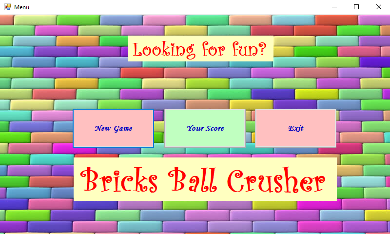

<b>BricksBallCrusher</b>

•	Краток опис на апликацијата

Идејата за нашата апликација произлезе од играта Bricks Ball Crusher, со некои наши модификации и дополнителни функционалности. Целта на апликацијата е да се освојат што е можно повеќе поени со ограничен број на животи. Следат подетални информации во врска со апликацијата.

•	Упатства

На почеток, по вклучување на апликацијата се прикажува главно мени на кое има три опции, една за нова игра “New Game”, друга за приказ на вашите поени “You Score”, и трета опција за излез од апликацијата “Exit”.

 

По кликање на "New Game"(или со стрелките лево-десно, па Ентер) се отвара нов прозорец со главната игра. Со кликање на стрелките од тастатурата, лево и десно, се поместува долниот правоаголник кој всушност ние го контролираме. Со првото притискање на било кое копче од двете, лево или десно, топчето започнува да се движи во рандом насока. Кога ќе допре некоја од "тулите", тие се кршаат. Ако во случај бидат допрени повеќе тули тие ќе бидат скршени истовремено. Топчето се одбива назад или ако се удри попат и од други тули и тие се кршат.
 

